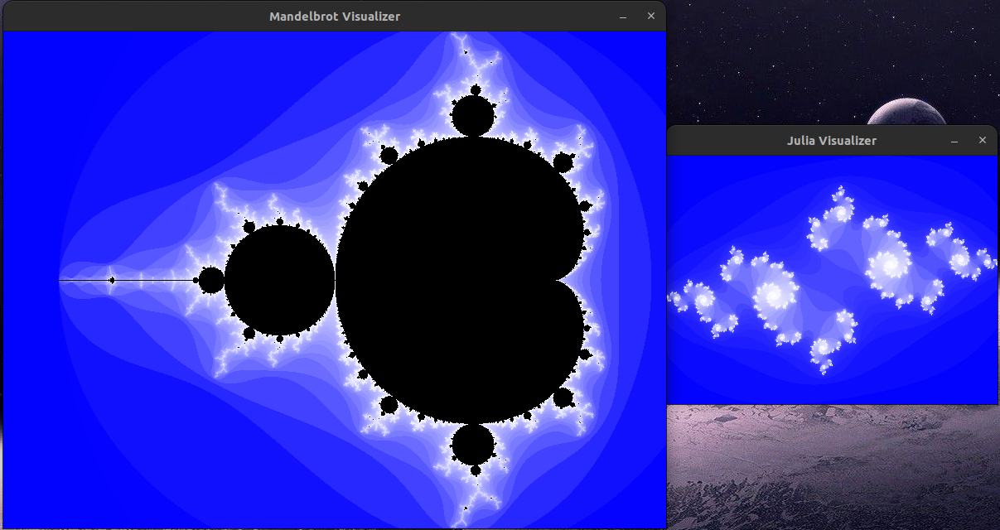
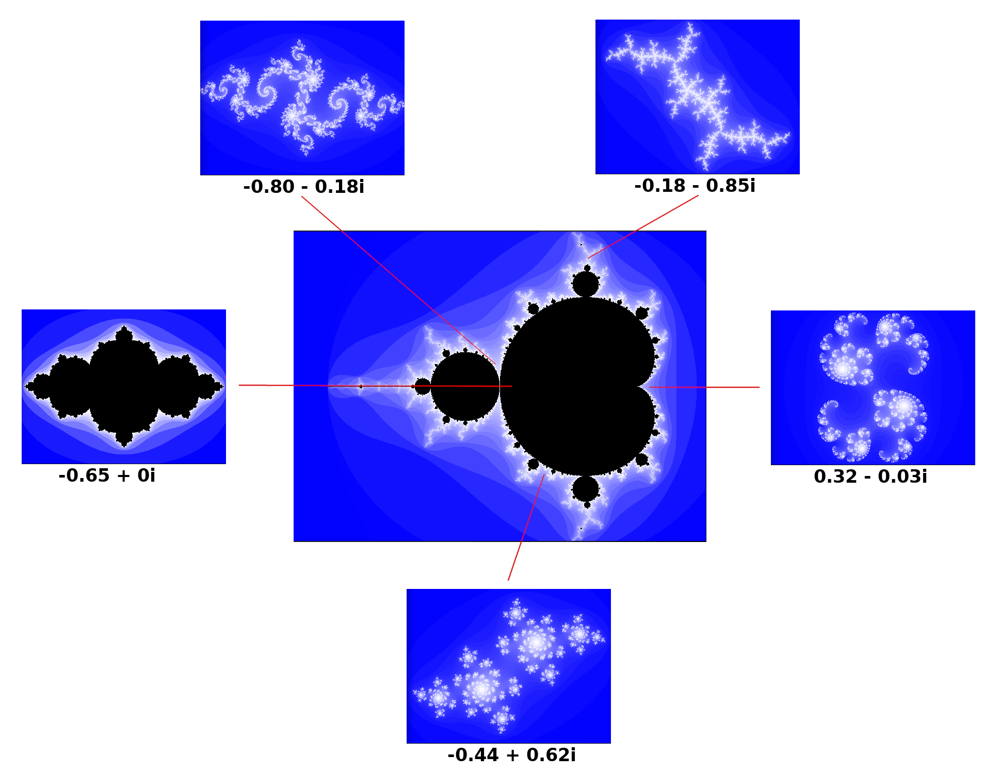

<a name="readme-top"></a>

[![MIT License][license-shield]][license-url]
[![LinkedIn][linkedin-shield]][linkedin-url]

<div align="center">
    <h3 align="center">Mandelbrot and Julia Set Visualizer</h3>
</div>

<details>
  <summary>Table of Contents</summary>
  <ol>
    <li>
      <a href="#about-the-project">About The Project</a>
      <ul>
        <li><a href="#built-with">Built With</a></li>
      </ul>
    </li>
    <li>
      <a href="#getting-started">Getting Started</a>
      <ul>
        <li><a href="#prerequisites">Prerequisites</a></li>
        <li><a href="#installation">Installation</a></li>
      </ul>
    </li>
    <li><a href="#improvements">Improvements</a></li>
    <li><a href="#license">License</a></li>
  </ol>
</details>

## About The Project

<br/>
<div align="center">
    
</div>
<br/>

The Mandelbrot set is the set of numbers $c$ in the complex plane for which the iteration $z_{n+1} = z_{n} + c$ does not
diverge to infinity when iterating starting from $z_{0} = 0$. As shown in the screenshot above, this application
displays two windows, the left of which plots the Mandelbrot set. For a given complex number $c_{0}$ hovered over by the
mouse pointer, the right window plots the corresponding Julia set consisting of numbers $z$ for which the function $z_
{n+1} = z_{n} + c_{0}$ does not diverge to infinity starting from $z_{0}=z$.

As you hover the mouse pointer over different points on the Mandelbrot set, watch as the right window transforms from
one Julia set to another. Because a different Julia set is generated for each point on the Mandelbrot set, the
Mandelbrot set can be considered a map of all Julia sets.

Below, we show some Julia sets along with their corresponding locations in the Mandelbrot set:

<div align="center">
    
</div>


Additional features of the application on the Mandelbrot set window:

- `Left click` to zoom in and `right click` to zoom out.
- Press the `space bar` to restore the default scale.

<p align="right">(<a href="#readme-top">back to top</a>)</p>

### Built With

* [SDL][sdl-url] Simple DirectMedia Layer
* [CMake][cmake-url] C++ build system

<p align="right">(<a href="#readme-top">back to top</a>)</p>

## Getting Started

To get a local copy up and running follow these simple example steps.

### Prerequisites

* npm
  ```sh
  npm install npm@latest -g
  ```

### Installation

1. Get a free API Key at [https://example.com](https://example.com)
2. Clone the repo
   ```sh
   git clone https://github.com/your_username_/Project-Name.git
   ```
3. Install NPM packages
   ```sh
   npm install
   ```
4. Enter your API in `config.js`
   ```js
   const API_KEY = 'ENTER YOUR API';
   ```

<p align="right">(<a href="#readme-top">back to top</a>)</p>

Build the dependencies for Ubuntu 22.04+:

```bash
$ sudo apt-get install build-essential git make \
pkg-config cmake ninja-build gnome-desktop-testing libasound2-dev libpulse-dev \
libaudio-dev libjack-dev libsndio-dev libx11-dev libxext-dev \
libxrandr-dev libxcursor-dev libxfixes-dev libxi-dev libxss-dev \
libxkbcommon-dev libdrm-dev libgbm-dev libgl1-mesa-dev libgles2-mesa-dev \
libegl1-mesa-dev libdbus-1-dev libibus-1.0-dev libudev-dev fcitx-libs-dev \
libpipewire-0.3-dev libwayland-dev libdecor-0-dev
```

Install SDL2:

```bash
sudo apt-get install libsdl2-2.0-0 libsdl2-dev 
```

## Improvements

The nested loop in `Fractal::calculateIterationsAndHistogram` is the bottleneck in computing the pixels for the fractal.
However, this loop is an embarrassingly parallel workload, which can be decomposed to be completed by multiple threads
using [OpenMP](https://www.openmp.org/).

<p align="right">(<a href="#readme-top">back to top</a>)</p>

## License

Distributed under the MIT License. See `LICENSE.txt` for more information.

<p align="right">(<a href="#readme-top">back to top</a>)</p>

<!-- MARKDOWN LINKS & IMAGES -->
<!-- https://www.markdownguide.org/basic-syntax/#reference-style-links -->

[license-url]: LICENSE.txt

[linkedin-url]: https://www.linkedin.com/in/faerlin-pulido/

[sdl-url]: https://www.libsdl.org/

[cmake-url]: https://cmake.org/

[license-shield]: https://img.shields.io/github/license/othneildrew/Best-README-Template.svg?style=for-the-badge

[linkedin-shield]: https://img.shields.io/badge/-LinkedIn-black.svg?style=for-the-badge&logo=linkedin&colorB=555